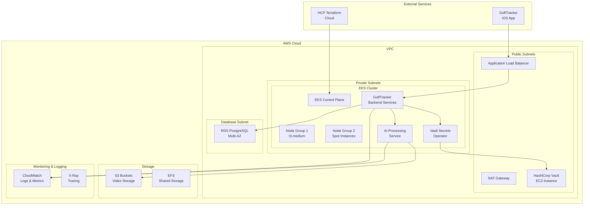

# GolfTrackerAnalytics Infrastructure Architecture

## Overview

The GolfTrackerAnalytics infrastructure is designed as a cost-optimized, secure, and scalable backend for the GolfTracker iOS application. The architecture supports AI-powered golf swing analysis with video processing capabilities while maintaining operational efficiency through automation.

## Architecture Diagram

## Core Components

### 1. Amazon EKS Cluster
- **Purpose**: Container orchestration for application services
- **Configuration**: 
  - Multi-AZ deployment for high availability
  - Mixed instance types (on-demand + spot) for cost optimization
  - Auto-scaling enabled with cluster autoscaler
  - Pod-level security with Pod Security Standards

### 2. HashiCorp Vault (EC2 Bare-Metal)
- **Purpose**: Centralized secrets management
- **Deployment**: 
  - Single EC2 instance (t3.medium) with EBS encryption
  - Auto-unseal using AWS KMS
  - Daily automated backups to S3
  - Network isolation in public subnet with security groups

### 3. Vault Secrets Operator
- **Purpose**: Kubernetes-native secrets management
- **Function**: 
  - Syncs secrets from Vault to Kubernetes secrets
  - Automatic secret rotation
  - Secure communication with Vault using service accounts

### 4. Application Services
- **Backend API**: RESTful API for mobile app communication
- **AI Processing Service**: Video analysis and recommendation engine
- **File Processing**: Video upload and preprocessing pipeline
- **Authentication Service**: User management and JWT token handling

### 5. Data Layer
- **RDS PostgreSQL**: 
  - Multi-AZ deployment for high availability
  - Automated backups with 7-day retention
  - Encryption at rest and in transit
- **S3 Storage**: 
  - Video file storage with lifecycle policies
  - Intelligent tiering for cost optimization
  - Cross-region replication for disaster recovery

### 6. Monitoring & Observability
- **AWS CloudWatch**: 
  - Application and infrastructure metrics
  - Log aggregation and analysis
  - Custom dashboards and alarms
- **AWS X-Ray**: Distributed tracing for performance analysis
- **Prometheus & Grafana**: Advanced metrics and visualization (optional)

## Security Architecture

### Network Security
- **VPC**: Isolated network environment with public/private subnets
- **Security Groups**: Restrictive ingress/egress rules
- **NACLs**: Additional network-level access control
- **WAF**: Web Application Firewall for ALB protection

### Data Security
- **Encryption at Rest**: All storage encrypted (EBS, RDS, S3)
- **Encryption in Transit**: TLS 1.3 for all communications
- **Secrets Management**: HashiCorp Vault for sensitive data
- **IAM**: Principle of least privilege access

### Application Security
- **Pod Security**: Kubernetes Pod Security Standards
- **Network Policies**: Micro-segmentation within EKS
- **RBAC**: Role-based access control for Kubernetes
- **Service Mesh**: Istio for service-to-service encryption (optional)

## Cost Optimization Strategy

### Infrastructure Scaling
- **Auto-scaling**: Horizontal and vertical scaling based on demand
- **Spot Instances**: Up to 70% cost savings for non-critical workloads
- **Scheduled Scaling**: Automatic scale-down during low usage periods

### Resource Management
- **Resource Requests/Limits**: Kubernetes resource management
- **Node Affinity**: Efficient pod placement strategies
- **Storage Optimization**: S3 lifecycle policies and intelligent tiering

### Automation
- **Infrastructure as Code**: Complete automation with Terraform
- **GitOps**: Automated deployments through HCP Terraform
- **Cost Monitoring**: Automated cost alerts and optimization recommendations

## Disaster Recovery

### Backup Strategy
- **RDS**: Automated backups with point-in-time recovery
- **Vault**: Daily snapshots to S3 with cross-region replication
- **Application Data**: Regular etcd backups for EKS

### Recovery Procedures
- **RTO**: Recovery Time Objective of 4 hours
- **RPO**: Recovery Point Objective of 1 hour
- **Multi-AZ**: Automatic failover for critical components

## Deployment Strategy

### Environment Management
- **Development**: Single-node EKS cluster with minimal resources
- **Staging**: Production-like environment for testing
- **Production**: Multi-AZ, high-availability configuration

### CI/CD Pipeline
- **Source Control**: Integration with Git repositories
- **HCP Terraform**: Automated infrastructure deployments
- **Kubernetes Deployments**: Rolling updates with zero downtime

## Performance Considerations

### Application Performance
- **Load Balancing**: ALB with multiple target groups
- **Caching**: Redis cluster for session and data caching
- **CDN**: CloudFront for static content delivery

### AI Processing
- **GPU Instances**: For intensive video processing (optional)
- **Batch Processing**: SQS/Batch for async video analysis
- **Model Optimization**: Efficient model serving with TensorRT

## Compliance & Governance

### Data Privacy
- **GDPR Compliance**: Data protection and user rights
- **Data Residency**: Regional data storage requirements
- **Audit Logging**: Comprehensive audit trails

### Operational Governance
- **Resource Tagging**: Consistent tagging strategy
- **Cost Allocation**: Department/project cost tracking
- **Access Management**: Centralized identity and access

## Future Enhancements

### Scalability Improvements
- **Multi-Region**: Cross-region deployment for global scale
- **Microservices**: Further service decomposition
- **Event-Driven**: Event sourcing and CQRS patterns

### Technology Upgrades
- **Service Mesh**: Istio for advanced traffic management
- **Serverless**: Lambda functions for event processing
- **ML Pipeline**: MLOps with SageMaker integration

## Maintenance & Operations

### Regular Tasks
- **Security Updates**: Monthly security patch cycles
- **Backup Verification**: Weekly backup restore tests
- **Performance Review**: Monthly performance optimization

### Monitoring & Alerting
- **Health Checks**: Comprehensive health monitoring
- **SLA Monitoring**: Service level agreement tracking
- **Incident Response**: Automated incident management
